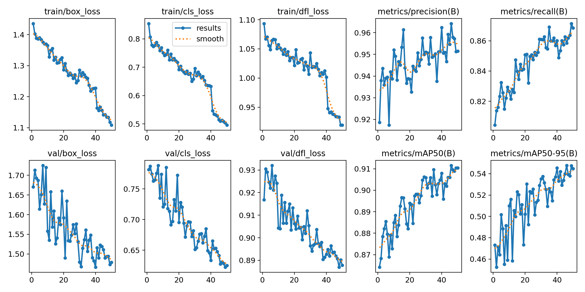
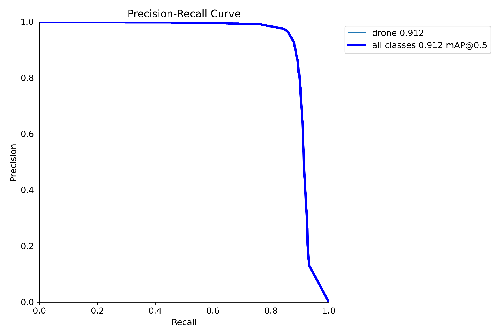
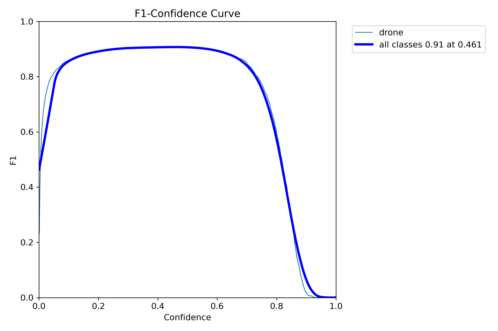
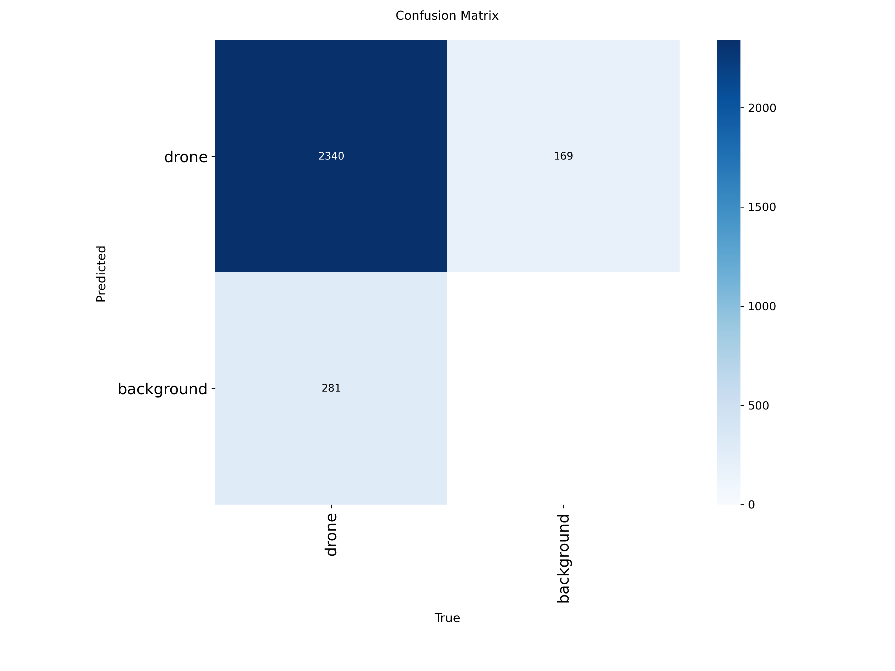
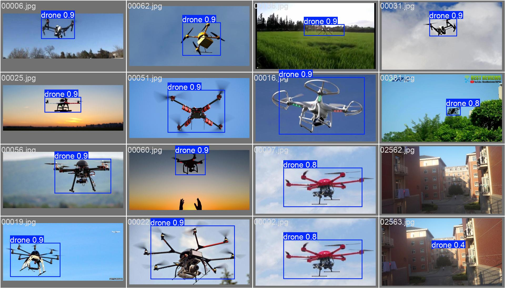
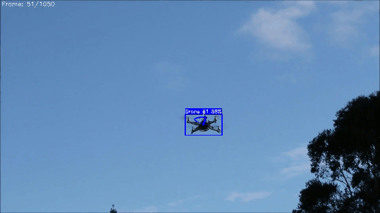
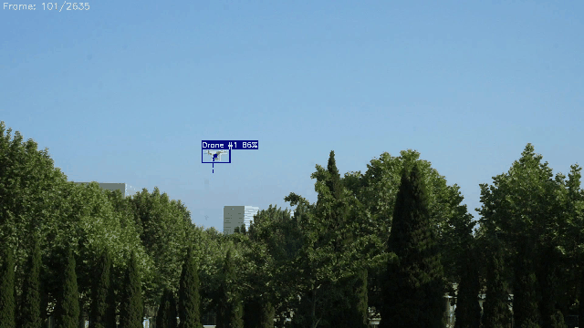

# Anti-Drone Detection & Tracking System

Real-time drone detection and tracking system for anti-drone defense applications.

YOLOv8 기반 드론 탐지 → ByteTrack 영상 추적 → 야간/악천후 강인성 → 새 vs 드론 분류까지 단계별로 구축하는 프로젝트입니다.

---

## Acknowledgments
- AI assistant (Claude) was used for code review, debugging, and documentation throughout the project.

---

## Project Overview

| Phase | Task | Method | Status |
|-------|------|--------|--------|
| 1 | Image Detection | YOLOv8m | ✅ Complete |
| 2 | Video Tracking | ByteTrack | 🔜 Next |
| 3 | Night/Weather Robustness | IR augmentation | ⬜ Planned |
| 4 | Bird vs Drone Classification | Multi-class | ⬜ Planned |

---

## Phase 1: YOLOv8 Drone Detection

### Dataset
- **DUT Anti-UAV** — 10,000 images (train 5,200 / val 2,600 / test 2,200)
- Annotations converted from XML (VOC) → YOLO txt format

### Training
- **Model**: YOLOv8m (medium)
- **GPU**: NVIDIA RTX 3070 Laptop (8GB VRAM)
- **Epochs**: 100 (50 initial + 50 fine-tuning)
- **Input size**: 640×640

### Results

| Metric | Score |
|--------|-------|
| mAP@50 | **91.1%** |
| mAP@50-95 | 54.9% |
| Precision | 95.9% |
| Recall | 86.1% |
| F1-optimal threshold | 0.461 |
| Inference speed | ~5ms/image |

### Training Curves
<p align="center">
  
</p>

### Precision-Recall & F1 Curve
<p align="center">
  
  
</p>

### Confusion Matrix
<p align="center">
  
</p>

### Detection Example
<p align="center">
  
</p>

### SAHI (Slicing Aided Hyper Inference) Experiment
Small object detection 향상을 위해 SAHI를 적용해 실험했으나, DUT Anti-UAV 데이터셋 특성상 대형 드론이 81%를 차지하여 효과가 제한적이었습니다.

- 오탐(FP) 12 → 82로 증가 (구름, 나뭇잎, 로고 등 오탐)
- mAP 소폭 하락
- **결론**: 이 데이터셋에서는 기본 YOLOv8 추론이 최적

> SAHI는 소형 드론이나 원거리 촬영 데이터에서 효과적이며, 실제 안티드론 시스템에서는 적용 가치가 있습니다.

---


## Phase 2: ByteTrack Video Tracking

### Overview
Phase 1의 YOLOv8 탐지 모델을 활용하여, 영상에서 프레임 간 드론을 추적합니다. 각 드론에 고유 ID를 부여하고 이동 궤적을 시각화합니다.

### Method
- **Tracker**: ByteTrack (Ultralytics 내장)
- **Input**: Anti-UAV-Tracking 데이터셋 (프레임 이미지 시퀀스)
- **Pipeline**: YOLOv8 Detection (per-frame) → ByteTrack ID Association → Trajectory Visualization

### ByteTrack Custom Configuration
Occlusion(가림 현상) 대응을 위해 기본 설정에서 파라미터를 튜닝했습니다.

| Parameter | Default | Custom | 목적 |
|-----------|---------|--------|------|
| track_buffer | 30 | 150 | 가림 후 재등장 시 ID 유지 (5초) |
| new_track_thresh | 0.3 | 0.6 | 새 ID 부여 기준 상향 |

### Tracking Evaluation (MOTMetrics)

| Metric | video01 (Occlusion) | video10 (Clear) |
|--------|-------------------|-----------------|
| **MOTA** (추적 정확도) | 85.5% | 83.9% |
| **IDF1** (ID 일관성) | 63.0% | 91.3% |
| **ID Switches** | 2 | 0 |
| Misses (미탐지) | 144 / 1050 | 417 / 2635 |
| False Positives | 6 | 6 |

### Analysis
- **Clear sky 환경 (video10)**: IDF1 91.3%로 높은 ID 일관성. 2635프레임 동안 ID Switch 0회 달성
- **Occlusion 환경 (video01)**: 나무에 의한 가림 발생 시 ID 일관성이 63%로 하락. 드론이 장애물 뒤로 지나갈 때 탐지가 끊기며 새로운 ID가 부여됨
- **한계점**: 카메라 단독으로는 Occlusion 해결에 한계 → 실제 안티드론 시스템에서 레이더 + 카메라 **멀티센서 융합**이 필요한 이유
```

**3. Project Structure에 파일 3개 추가:**

`train.py` 아래에:
```
│   ├── track.py              # ByteTrack 영상 추적
│   ├── eval_tracking.py      # 추적 정확도 평가 (MOTMetrics)
```

`dataset.yaml` 아래에:
```
│   └── bytetrack_custom.yaml # ByteTrack 커스텀 설정
```

**4. Tech Stack에 추가:**
```
- **Tracking**: ByteTrack
- **Evaluation**: MOTMetrics (MOTA, IDF1)


### Tracking Demo
<p align="center">
  
  
</p>
<p align="center">
  <em>Left: Occlusion 환경 (video01) | Right: Clear sky 환경 (video10)</em>
</p>


---


## Demo

Streamlit 기반 웹 데모 — 이미지 업로드 → 드론 탐지 → 바운딩 박스 시각화

```bash
cd demo
streamlit run demo_app.py
```

**Features:**
- Confidence threshold 실시간 조절
- 드론 크기 분류 (Small/Medium/Large)
- 탐지 통계 대시보드
- 샘플 이미지 제공

---

## Project Structure

```
drone-detection-tracking/
├── src/
│   ├── train.py            # YOLOv8 학습 스크립트
│   ├── sahi_infer.py       # SAHI 추론
│   ├── sahi_eval.py        # SAHI 평가
│   ├── sahi_analysis.py    # SAHI 결과 분석
│   └── dataset.yaml        # 데이터셋 설정
├── demo/
│   └── demo_app.py         # Streamlit 데모 앱
├── scripts/
│   └── prepare_data.py     # XML→YOLO 포맷 변환
├── results/                # 학습 결과 그래프
├── requirements.txt
└── README.md
```

---

## Setup

```bash
git clone https://github.com/kimma2212/drone-detection-tracking.git
cd drone-detection-tracking
python -m venv venv
venv\Scripts\activate        # Windows
pip install -r requirements.txt
```

---

## Tech Stack

- **Detection**: YOLOv8 (Ultralytics)
- **Tracking**: ByteTrack (Phase 2)
- **Framework**: PyTorch
- **Demo**: Streamlit
- **Analysis**: SAHI, OpenCV, NumPy

---


## License

This project is licensed under the MIT License - see the [LICENSE](LICENSE) file for details.
